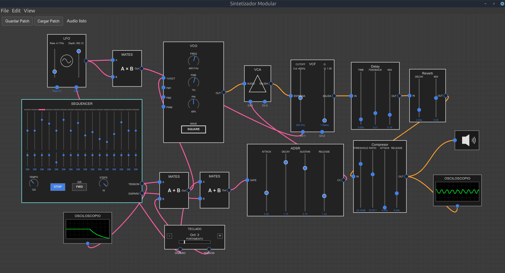

# Sintetizador Modular Electrónico



Este es un sintetizador modular de escritorio desarrollado con Electron.js, que permite a los usuarios crear y experimentar con síntesis de audio modular en tiempo real. Inspirado en los sintetizadores hardware, ofrece una interfaz visual para conectar módulos virtuales y explorar un vasto universo de posibilidades sonoras.

## Descripción del Proyecto

El objetivo principal de este proyecto es proporcionar una plataforma flexible y potente para la creación musical y la experimentación sonora. Utiliza la Web Audio API y AudioWorklets para un procesamiento de audio de baja latencia y alta calidad, encapsulando la lógica de cada componente del sintetizador en módulos independientes que pueden interconectarse libremente.

## Características Principales

*   **Arquitectura Modular:** Conecta y desconecta módulos virtuales como osciladores (VCO), filtros (VCF), amplificadores controlados por voltaje (VCA), envolventes (ADSR), LFOs, mezcladores, efectos (Delay, Reverb, Compressor) y más.
*   **Procesamiento de Audio en Tiempo Real:** Basado en la Web Audio API para un rendimiento de audio óptimo.
*   **AudioWorklets:** Utiliza AudioWorklets para un procesamiento de señal eficiente y personalizado, especialmente en módulos críticos como VCOs y secuenciadores.
*   **Interfaz Gráfica Intuitiva:** Arrastra y suelta módulos, conecta cables virtuales entre entradas y salidas, y ajusta parámetros directamente en la pantalla.
*   **Menú Contextual de Módulos:**
    *   **Duplicar Módulo:** Crea una copia exacta de un módulo existente.
    *   **Eliminar Módulo:** Elimina módulos de la interfaz.
    *   **Bypass de Efectos:** Desactiva módulos de efecto específicos (VCF, Delay, Reverb, Compressor) permitiendo que la señal pase a través de ellos sin ser procesada, ideal para comparar el sonido con y sin el efecto.
*   **Secuenciador Avanzado:**
    *   Control de tempo, dirección y número de pasos.
    *   Sliders de tono y duración de gate por paso.
    *   Funcionalidad **SKIP** para saltar pasos, permitiendo la creación de ritmos complejos y polimétricos.
    *   Salida de Tensión (CV) calibrada a 1V/Octava, compatible con otros módulos de sintetizador.
    *   Salida de Disparo (Gate) para activar envolventes y otros eventos.
*   **Guardar y Cargar Patches:** Guarda tus configuraciones de sintetizador (patches) y cárgalas en cualquier momento para retomar tu trabajo.

## Tecnologías Utilizadas

*   **Electron.js:** Para construir la aplicación de escritorio multiplataforma.
*   **Web Audio API:** Para todo el procesamiento y enrutamiento de audio.
*   **JavaScript (ES6+):** Lenguaje principal de desarrollo.
*   **HTML5/CSS3:** Para la estructura y el estilo de la interfaz de usuario.
*   **Canvas API:** Para el dibujo de los módulos y las conexiones.

## Cómo Ejecutar el Proyecto

Para ejecutar este proyecto localmente, sigue estos pasos:

1.  **Clona el repositorio:**
    ```bash
    git clone https://github.com/tonetxo/Sintetizador-Modular.git
    cd Sintetizador-Modular
    ```
2.  **Instala las dependencias:**
    ```bash
    npm install
    ```
3.  **Inicia la aplicación:**
    ```bash
    npm start
    ```

Esto abrirá la aplicación de escritorio del sintetizador modular.

---
